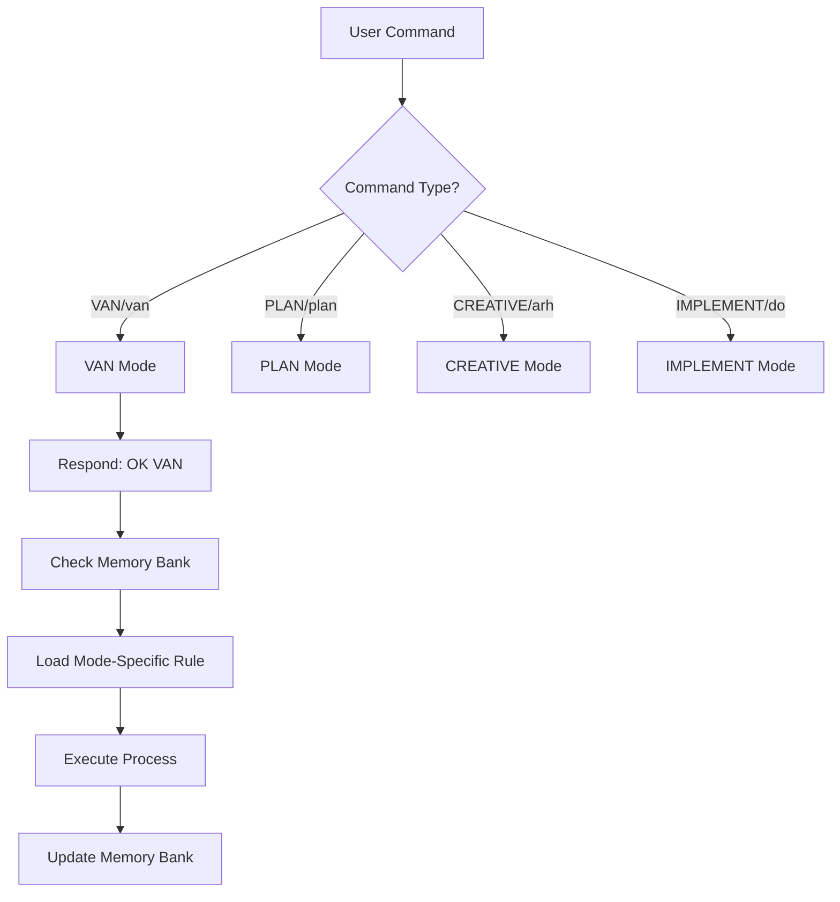
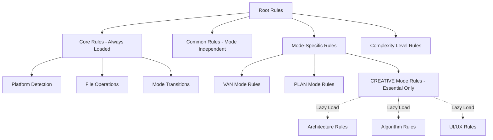

# Cursor Memory Bank Analysis & Pydantic AI Replication Strategy

## Executive Summary

This document provides a comprehensive analysis of the cursor-memory-bank system and a detailed strategy for replicating its workflow control and lazy loading mechanisms using Pydantic AI, Claude Code, and Claude Agents.

**Key Findings:**
- cursor-memory-bank uses hierarchical rule loading achieving 78% token reduction
- Workflow control is enforced through forced mode transitions based on complexity detection
- The system can be fully replicated using Pydantic AI agents with result validators and dynamic tool registration

---

## Table of Contents

1. [How cursor-memory-bank Works](#how-cursor-memory-bank-works)
2. [Entry Point & Activation](#entry-point--activation)
3. [Mode-Specific Workflows](#mode-specific-workflows)
4. [Lazy Loading Implementation](#lazy-loading-implementation)
5. [Replication Strategy with Pydantic AI](#replication-strategy-with-pydantic-ai)
6. [Implementation Guide](#implementation-guide)
7. [Next Steps](#next-steps)

---

## How cursor-memory-bank Works

### System Architecture

The cursor-memory-bank system is a token-optimized, hierarchical task management system that integrates with Cursor's custom modes. It provides structured workflow phases for software development:

```
VAN (Init) → PLAN → CREATIVE → IMPLEMENT → REFLECT → ARCHIVE
```

### Core Components

1. **Custom Modes**: Specialized AI personalities for each development phase
2. **Memory Bank**: Persistent markdown files maintaining state across sessions
3. **Visual Maps**: Mermaid diagrams defining process flows
4. **Rule System**: Hierarchical `.mdc` files loaded on-demand
5. **Command System**: Text commands triggering mode transitions

---

## Entry Point & Activation

### Master Control Flow

The system entry point is `custom_modes/van_instructions.md` (lines 1-247), which serves as the **master control flow** for all mode activations.

### Command Detection Flow

When a user types a command:



### Critical Steps

1. **Command Detection** (lines 8-26): Recognizes both original and custom commands
2. **Immediate Response** (lines 28-34): Returns confirmation (e.g., "OK VAN")
3. **Memory Bank Check** (lines 37-43): **MANDATORY** - verifies memory bank exists
4. **Rule Loading** (lines 46-52): Loads mode-specific visual maps from `.cursor/rules/isolation_rules/visual-maps/`
5. **Execution** (lines 55-61): Executes the process defined in the loaded rule
6. **Continuous Updates** (lines 64-70): Updates memory bank files throughout execution

---

## Mode-Specific Workflows

### VAN Mode Activation Path

**File Reference**: `custom_modes/van_instructions.md`, `.cursor/rules/isolation_rules/visual-maps/van_mode_split/van-mode-map.mdc`

When you type `VAN` or `van`:

```
Command → "OK VAN" response
  ↓
Check Memory Bank (MANDATORY)
  ↓
Load: van-mode-map.mdc
  ↓
Platform Detection (Windows/Mac/Linux)
  ↓
Basic File Verification
  ↓
Complexity Determination (KEY DECISION POINT)
  ├─ Level 1 → Continue in VAN → Initialize → Done
  └─ Level 2-4 → FORCE EXIT to PLAN mode
```

**Critical Flow Detail** (`van-mode-map.mdc:16-50`):

- Lines 39-42: If Level 2-4 detected, VAN mode **blocks implementation** and forces transition to PLAN mode
- This is the core workflow control mechanism

**Complexity Levels**:

- **Level 1**: Quick bug fix (can implement directly in VAN)
- **Level 2**: Simple enhancement (requires PLAN mode)
- **Level 3**: Intermediate feature (requires PLAN + CREATIVE modes)
- **Level 4**: Complex system (requires full workflow)

### PLAN Mode Activation Path

**File Reference**: `custom_modes/plan_instructions.md`, `.cursor/rules/isolation_rules/visual-maps/plan-mode-map.mdc`

When you type `PLAN` or `plan`:

```
Command → "OK PLAN" response
  ↓
Check Memory Bank
  ↓
Load: plan-mode-map.mdc
  ↓
Read tasks.md
  ↓
Determine Complexity Level (from tasks.md)
  ├─ Level 2 → Simplified planning
  ├─ Level 3 → Comprehensive planning + flag creative components
  └─ Level 4 → Phased implementation + architectural diagrams
  ↓
Update tasks.md with plan
  ↓
Check if creative phases required
  ├─ Yes → Recommend CREATIVE mode
  └─ No → Recommend IMPLEMENT mode
```

**Key File**: `plan_instructions.md:10-43` shows the decision tree

**Planning Process by Level**:

- **Level 2**:
  - Overview of changes
  - Files to modify
  - Implementation steps
  - Potential challenges

- **Level 3-4**:
  - Requirements analysis
  - Components affected
  - Architecture considerations
  - Implementation strategy
  - Detailed steps
  - Dependencies
  - Challenges & mitigations
  - Creative phase components

### CREATIVE Mode Activation Path

**File Reference**: `custom_modes/creative_instructions.md`, `.cursor/rules/isolation_rules/visual-maps/creative-mode-map.mdc`

When you type `CREATIVE` or `arh`:

```
Command → "OK CREATIVE" response
  ↓
Check Memory Bank
  ↓
Load: creative-mode-map.mdc
  ↓
Identify components requiring creative phases
  ↓
Determine creative phase type
  ├─ Architecture Design → Load: creative-phase-architecture.mdc
  ├─ Algorithm Design → Load: creative-phase-algorithm.mdc
  └─ UI/UX Design → Load: creative-phase-uiux.mdc
  ↓
Generate multiple design options (2-4 options)
  ↓
Analyze pros/cons of each option
  ↓
Select and justify recommended approach
  ↓
Document implementation guidelines
  ↓
Verify against requirements
  ↓
Update Memory Bank with design decisions
  ↓
Check for more components
  ├─ Yes → Return to component processing
  └─ No → Recommend IMPLEMENT mode
```

**Creative Phase Types**:

1. **Architecture Design**: System structure, component relationships, technical foundations
2. **Algorithm Design**: Efficiency, correctness, time/space complexity
3. **UI/UX Design**: User experience, accessibility, design patterns

---

## Lazy Loading Implementation

This is one of the most sophisticated aspects of cursor-memory-bank!

### Hierarchical Rule Loading System

**File Reference**: `.cursor/rules/isolation_rules/Core/hierarchical-rule-loading.mdc:42-72`

The system uses a **hierarchical rule loading** approach with three tiers:



### Loading Phases

#### Phase 1: Initial Load (Essential Only - ~15,000 tokens)

When a mode is activated:

```javascript
// Pseudocode representation
initializeMode(modeName, complexityLevel) {
  // Always load core rules
  loadCoreRules();              // platform-awareness, file-verification

  // Load common rules
  loadCommonRules();            // command-execution

  // Load essential mode-specific rules
  loadEssentialModeRules(modeName);  // van-mode-map.mdc only

  // Load complexity level rules
  loadComplexityRules(complexityLevel);

  // Register lazy loaders for specialized functionality
  registerLazyLoaders(modeName, complexityLevel);
}
```

#### Phase 2: Lazy Loading (On-Demand - ~10,000 tokens)

When specialized functionality is needed:

```javascript
// Example: CREATIVE mode needs architecture guidance
loadSpecializedRule(ruleType) {
  if (this.lazyLoaders[ruleType]) {
    if (!this.cache.specialized[ruleType]) {
      // Load only when first requested
      const rule = this.lazyLoaders[ruleType]();
      this.cache.specialized[ruleType] = rule;
    }
    return this.cache.specialized[ruleType];
  }
}
```

**Example Flow**:

```
CREATIVE mode starts → Loads only creative-mode-map.mdc
  ↓
User identifies "Architecture Design" needed
  ↓
System lazy loads: creative-phase-architecture.mdc (on-demand)
  ↓
Rule cached for subsequent use in this session
```

### Rule Dependency Map

**File Reference**: `hierarchical-rule-loading.mdc:150-181`

```
Main Rules (Always Loaded):
├── main.mdc
├── platform-awareness.mdc
├── file-verification.mdc
└── command-execution.mdc

VAN Mode:
├── van-mode-map.mdc (Essential)
├── van-complexity-determination.mdc (Essential)
├── van-file-verification.mdc (Essential)
└── van-platform-detection.mdc (Essential)

PLAN Mode:
├── plan-mode-map.mdc (Essential)
├── task-tracking-basic.mdc (Level-specific)
└── planning-comprehensive.mdc (Lazy loaded)

CREATIVE Mode:
├── creative-mode-map.mdc (Essential)
├── creative-phase-enforcement.mdc (Essential)
├── creative-phase-architecture.mdc (Lazy loaded)
├── creative-phase-algorithm.mdc (Lazy loaded)
└── creative-phase-uiux.mdc (Lazy loaded)
```

### Token Usage Comparison

| Approach | Initial Tokens | Specialized Tokens | Total Tokens |
|----------|---------------|-------------------|--------------|
| **Original System** | ~70,000 | Included in initial | ~70,000 |
| **Hierarchical System** | ~15,000 | ~10,000 (on demand) | ~25,000 |
| **Token Reduction** | **~55,000 (78%)** | **N/A** | **~45,000 (64%)** |

### Lazy Loading Benefits

1. **Reduced Initial Loading**: Only essential rules loaded at start (78% token reduction)
2. **Cached Core Rules**: Rules shared between modes are cached
3. **Specialized Rule Loading**: Specialized rules loaded only when needed
4. **Complexity-Based Loading**: Only load rules appropriate for task complexity
5. **Session Persistence**: Rules remain cached for the session duration

---

## Replication Strategy with Pydantic AI

### Architecture Overview

```
MemoryBankSystem/
├── agents/                    # Pydantic AI agents
│   ├── van_agent.py          # Initialization & complexity detection
│   ├── plan_agent.py         # Task planning
│   ├── creative_agent.py     # Design decisions
│   └── implement_agent.py    # Implementation
├── memory_bank/              # Persistent state (like cursor's memory-bank/)
│   ├── tasks.md
│   ├── activeContext.md
│   └── progress.md
├── rules/                    # Rule definitions
│   ├── core/
│   │   ├── platform_awareness.md
│   │   └── file_verification.md
│   └── modes/
│       ├── van/
│       ├── plan/
│       └── creative/
├── orchestrator.py           # Main workflow controller
└── lazy_loader.py           # Lazy rule loading system
```

### Core Components

#### 1. Workflow Control with Result Validators

The key to replicating cursor-memory-bank's forced transitions is using **Pydantic AI result validators**:

```python
from pydantic_ai import Agent, RunContext
from pydantic_ai.models.anthropic import AnthropicModel
from enum import Enum

class ComplexityLevel(Enum):
    LEVEL_1 = 1  # Quick fix
    LEVEL_2 = 2  # Simple enhancement
    LEVEL_3 = 3  # Intermediate feature
    LEVEL_4 = 4  # Complex system

class ForceTransitionToPlan(Exception):
    """Exception raised to force transition from VAN to PLAN mode"""
    def __init__(self, message: str, next_mode: str, state):
        self.message = message
        self.next_mode = next_mode
        self.state = state
        super().__init__(self.message)

class MemoryBankState:
    """Persistent state across agents (replaces memory-bank/ directory)"""
    tasks: dict
    complexity: ComplexityLevel | None
    current_mode: str
    platform: str
    memory_bank_files: dict  # In-memory representation of .md files

# VAN Agent - Entry point
van_agent = Agent(
    model=AnthropicModel("claude-sonnet-4"),
    system_prompt="""You are the VAN initialization agent.

    Your role:
    1. Verify memory bank exists (check state.memory_bank_files)
    2. Detect platform (Windows/Mac/Linux)
    3. Perform file verification
    4. Analyze task complexity based on:
       - Scope: Single file vs. multiple subsystems
       - Risk: Low vs. high impact changes
       - Effort: Minutes vs. hours/days
       - Dependencies: Isolated vs. cross-cutting

    5. Determine complexity level:
       - LEVEL 1: Quick bug fix, typo correction, simple config change
       - LEVEL 2: Simple enhancement, new utility function, UI tweak
       - LEVEL 3: Intermediate feature, new component, API endpoint
       - LEVEL 4: Complex system, architecture change, major refactor

    6. FOR LEVEL 2-4: Return result indicating forced transition needed
    7. FOR LEVEL 1: Complete initialization and return success

    Always include 'complexity_level' in your result.
    """,
    result_type=dict
)

@van_agent.result_validator
async def check_complexity_level(ctx: RunContext[MemoryBankState], result: dict) -> dict:
    """
    This replicates the FORCE EXIT mechanism in VAN mode.

    Equivalent to van-mode-map.mdc lines 39-42:
    - If Level 2-4 detected, VAN mode blocks implementation
    - Forces transition to PLAN mode
    """
    complexity = result.get('complexity_level')

    if complexity in [ComplexityLevel.LEVEL_2, ComplexityLevel.LEVEL_3, ComplexityLevel.LEVEL_4]:
        # This is the key workflow control mechanism!
        raise ForceTransitionToPlan(
            message=f"🚫 LEVEL {complexity.value} TASK DETECTED\n"
                   f"Implementation in VAN mode is BLOCKED\n"
                   f"This task REQUIRES PLAN mode\n"
                   f"Type 'PLAN' to switch to planning mode",
            next_mode="PLAN",
            state=ctx.deps
        )

    # Level 1 - allow VAN mode to continue
    return result
```

#### 2. Plan Agent with Creative Phase Detection

```python
class ForceTransitionToCreative(Exception):
    """Exception raised to force transition from PLAN to CREATIVE mode"""
    def __init__(self, message: str, next_mode: str, components: list):
        self.message = message
        self.next_mode = next_mode
        self.components = components
        super().__init__(self.message)

# Plan Agent - Receives forced transitions
plan_agent = Agent(
    model=AnthropicModel("claude-sonnet-4"),
    system_prompt="""You are the PLAN agent.

    Your role:
    1. Read tasks.md and complexity level from memory bank
    2. Create appropriate planning based on complexity:
       - Level 2: Simplified planning (overview, files, steps, challenges)
       - Level 3: Comprehensive planning + identify creative components
       - Level 4: Phased implementation + architectural diagrams

    3. For Level 3-4: Identify components requiring creative phases:
       - Architecture decisions (system structure, component design)
       - Algorithm design (performance-critical logic)
       - UI/UX design (user interface components)

    4. Update tasks.md with the plan
    5. Return result indicating if creative phases are required

    Always include 'requires_creative_phase' and 'creative_components' in your result.
    """,
    result_type=dict
)

@plan_agent.result_validator
async def check_creative_requirement(ctx: RunContext[MemoryBankState], result: dict) -> dict:
    """
    Forces transition to CREATIVE if components need design decisions.

    Equivalent to plan-mode-map.mdc lines 46-49:
    - Check if creative phases required
    - If yes, recommend CREATIVE mode
    """
    if result.get('requires_creative_phase'):
        components = result.get('creative_components', [])
        raise ForceTransitionToCreative(
            message=f"🎨 CREATIVE PHASES REQUIRED\n"
                   f"The following components need design decisions:\n" +
                   "\n".join(f"  - {c}" for c in components) +
                   f"\n\nType 'CREATIVE' to begin design phase",
            next_mode="CREATIVE",
            components=components
        )
    return result
```

#### 3. Lazy Loading with Dynamic Tool Registration

```python
from pathlib import Path
from typing import Callable, Dict

class LazyRuleLoader:
    """
    Replicates cursor's hierarchical rule loading system.

    Equivalent to hierarchical-rule-loading.mdc:77-146
    """

    def __init__(self):
        self.loaded_rules: Dict[str, str] = {}
        self.lazy_loaders: Dict[str, Callable[[], str]] = {}

        # Core rules (always loaded)
        self._load_core_rules()

    def _load_core_rules(self):
        """Load essential rules immediately"""
        core_rules = [
            "platform_awareness",
            "file_verification",
            "command_execution"
        ]
        for rule in core_rules:
            self.loaded_rules[rule] = self._read_rule_file(f"rules/core/{rule}.md")

    def register_lazy_rule(self, rule_name: str, loader_func: Callable[[], str]):
        """
        Register a rule to be loaded on-demand.

        This is the key to lazy loading - rules are registered but not loaded
        until explicitly requested.
        """
        self.lazy_loaders[rule_name] = loader_func

    def get_rule(self, rule_name: str) -> str:
        """
        Load rule only when requested (lazy loading!)

        Equivalent to hierarchical-rule-loading.mdc:114-123
        """
        # Check if already loaded
        if rule_name not in self.loaded_rules:
            # Load on first request
            if rule_name in self.lazy_loaders:
                print(f"[Lazy Loading] Loading rule: {rule_name}")
                self.loaded_rules[rule_name] = self.lazy_loaders[rule_name]()
            else:
                raise ValueError(f"Rule '{rule_name}' not registered")

        return self.loaded_rules[rule_name]

    def _read_rule_file(self, filepath: str) -> str:
        """Helper to read rule files"""
        return Path(filepath).read_text()

    def get_loaded_rules_count(self) -> int:
        """Get count of currently loaded rules (for monitoring token usage)"""
        return len(self.loaded_rules)
```

#### 4. Creative Agent with Lazy-Loaded Specialized Rules

```python
# Creative Agent with lazy-loaded specialized rules
creative_agent = Agent(
    model=AnthropicModel("claude-sonnet-4"),
    system_prompt="""You are the CREATIVE design agent.

    Your role:
    1. Read tasks.md and implementation-plan.md
    2. Identify components flagged for creative phases
    3. For each component, determine the type:
       - Architecture Design
       - Algorithm Design
       - UI/UX Design

    4. Use the appropriate tool to load specialized guidance
    5. Generate 2-4 design options for each component
    6. Analyze pros/cons of each option
    7. Select and justify recommended approach
    8. Document implementation guidelines
    9. Verify against requirements

    10. Update memory bank with design decisions

    Use the load_*_guidance tools to access specialized design knowledge
    only when needed for specific component types.
    """,
    result_type=dict
)

@creative_agent.tool
async def load_architecture_guidance(ctx: RunContext[MemoryBankState]) -> str:
    """
    Lazy load architecture design rules (only when needed).

    Equivalent to loading creative-phase-architecture.mdc from cursor system.
    This is called only when architecture design is actually needed!
    """
    loader = ctx.deps.rule_loader
    return loader.get_rule("creative-phase-architecture")

@creative_agent.tool
async def load_algorithm_guidance(ctx: RunContext[MemoryBankState]) -> str:
    """
    Lazy load algorithm design rules (only when needed).

    Equivalent to loading creative-phase-algorithm.mdc from cursor system.
    """
    loader = ctx.deps.rule_loader
    return loader.get_rule("creative-phase-algorithm")

@creative_agent.tool
async def load_uiux_guidance(ctx: RunContext[MemoryBankState]) -> str:
    """
    Lazy load UI/UX design rules (only when needed).

    Equivalent to loading creative-phase-uiux.mdc from cursor system.
    """
    loader = ctx.deps.rule_loader
    return loader.get_rule("creative-phase-uiux")

@creative_agent.tool
async def update_memory_bank(ctx: RunContext[MemoryBankState],
                            component: str,
                            design_decision: dict) -> str:
    """Update memory bank with design decisions"""
    # Update the memory bank state
    if 'design_decisions' not in ctx.deps.memory_bank_files:
        ctx.deps.memory_bank_files['design_decisions'] = {}

    ctx.deps.memory_bank_files['design_decisions'][component] = design_decision

    # Also write to file for persistence
    decisions_file = Path("memory_bank/design_decisions.md")
    decisions_file.write_text(
        f"# Design Decisions\n\n"
        f"## {component}\n\n"
        f"{design_decision}\n"
    )

    return f"Design decision for {component} saved to memory bank"
```

#### 5. Orchestrator - Main Workflow Controller

```python
import asyncio
from typing import Optional

class MemoryBankOrchestrator:
    """
    Main workflow controller - replaces cursor's custom mode switching.

    This class handles:
    - Command detection and routing
    - Automatic mode transitions (forced transitions)
    - Memory bank state management
    - Lazy rule loading coordination
    """

    def __init__(self):
        self.state = MemoryBankState(
            tasks={},
            complexity=None,
            current_mode="VAN",
            platform=self._detect_platform(),
            memory_bank_files={}
        )

        self.rule_loader = LazyRuleLoader()

        # Register lazy loaders for specialized rules
        self._register_lazy_loaders()

    def _detect_platform(self) -> str:
        """Detect operating system"""
        import platform
        return platform.system()  # Returns 'Windows', 'Darwin' (Mac), or 'Linux'

    def _register_lazy_loaders(self):
        """
        Register lazy loaders for all specialized rules.

        Rules are registered but NOT loaded until explicitly requested.
        This achieves the 78% token reduction seen in cursor-memory-bank.
        """
        # Creative phase specialized rules
        self.rule_loader.register_lazy_rule(
            "creative-phase-architecture",
            lambda: Path("rules/modes/creative/architecture.md").read_text()
        )
        self.rule_loader.register_lazy_rule(
            "creative-phase-algorithm",
            lambda: Path("rules/modes/creative/algorithm.md").read_text()
        )
        self.rule_loader.register_lazy_rule(
            "creative-phase-uiux",
            lambda: Path("rules/modes/creative/uiux.md").read_text()
        )

        # Level-specific planning rules (lazy loaded based on complexity)
        self.rule_loader.register_lazy_rule(
            "planning-comprehensive",
            lambda: Path("rules/modes/plan/comprehensive.md").read_text()
        )
        self.rule_loader.register_lazy_rule(
            "architectural-planning",
            lambda: Path("rules/modes/plan/architectural.md").read_text()
        )

    async def run(self, user_command: str, task_description: Optional[str] = None):
        """
        Main entry point - replicates cursor's command detection.

        Equivalent to van_instructions.md:8-135

        Args:
            user_command: Command like "VAN", "PLAN", "CREATIVE"
            task_description: Optional task description for VAN mode
        """
        command = user_command.upper()

        if command in ["VAN"]:
            print(f"OK VAN - Beginning Initialization Process")
            return await self._run_van_mode(task_description)

        elif command == "PLAN":
            print(f"OK PLAN - Beginning Task Planning")
            return await self._run_plan_mode()

        elif command == "CREATIVE":
            print(f"OK CREATIVE - Beginning Design Phase")
            return await self._run_creative_mode()

        elif command == "IMPLEMENT":
            print(f"OK IMPLEMENT - Beginning Implementation")
            return await self._run_implement_mode()

        else:
            raise ValueError(f"Unknown command: {user_command}")

    async def _run_van_mode(self, task_description: str):
        """
        Execute VAN mode with automatic transition handling.

        Equivalent to van-mode-map.mdc
        """
        try:
            # Attach state to agent context
            result = await van_agent.run(
                f"Initialize project and analyze task: {task_description}",
                deps=self.state
            )

            # If we get here, it's Level 1 - VAN completed successfully
            self.state.current_mode = "VAN_COMPLETE"
            print(f"✅ VAN MODE COMPLETE - Level 1 task can proceed to implementation")
            return result

        except ForceTransitionToPlan as e:
            # Level 2-4 detected - automatic forced transition!
            print(f"\n{e.message}\n")
            print(f"🔄 Automatically transitioning to PLAN mode...\n")

            # Update state
            self.state.current_mode = "PLAN"

            # Automatically call PLAN agent
            return await self._run_plan_mode()

    async def _run_plan_mode(self):
        """
        Execute PLAN mode with automatic transition handling.

        Equivalent to plan-mode-map.mdc
        """
        try:
            result = await plan_agent.run(
                "Create implementation plan based on tasks.md and complexity level",
                deps=self.state
            )

            # PLAN completed without requiring creative phase
            self.state.current_mode = "PLAN_COMPLETE"
            print(f"✅ PLAN MODE COMPLETE - Ready for implementation")
            return result

        except ForceTransitionToCreative as e:
            # Creative phases required - automatic forced transition!
            print(f"\n{e.message}\n")
            print(f"🔄 Automatically transitioning to CREATIVE mode...\n")

            # Update state
            self.state.current_mode = "CREATIVE"
            self.state.memory_bank_files['creative_components'] = e.components

            # Automatically call CREATIVE agent
            return await self._run_creative_mode()

    async def _run_creative_mode(self):
        """
        Execute CREATIVE mode.

        Equivalent to creative-mode-map.mdc

        Note: This mode uses lazy loading for specialized design rules.
        """
        print(f"📊 Loaded rules count: {self.rule_loader.get_loaded_rules_count()}")

        result = await creative_agent.run(
            "Perform design decisions for flagged components",
            deps=self.state
        )

        print(f"📊 Loaded rules count after creative: {self.rule_loader.get_loaded_rules_count()}")
        print(f"   (Rules were lazy-loaded only when specific design types were needed)")

        self.state.current_mode = "CREATIVE_COMPLETE"
        print(f"✅ CREATIVE MODE COMPLETE - Design decisions documented")
        return result

    async def _run_implement_mode(self):
        """Execute IMPLEMENT mode"""
        # Implementation logic here
        pass

    def get_memory_bank_status(self) -> dict:
        """Get current memory bank state for debugging"""
        return {
            "current_mode": self.state.current_mode,
            "complexity": self.state.complexity,
            "platform": self.state.platform,
            "loaded_rules_count": self.rule_loader.get_loaded_rules_count(),
            "memory_bank_files": list(self.state.memory_bank_files.keys())
        }
```

---

## Implementation Guide

### Step 1: Set Up Project Structure

```bash
mkdir memory_bank_system
cd memory_bank_system

# Create directory structure
mkdir -p agents
mkdir -p memory_bank
mkdir -p rules/core
mkdir -p rules/modes/van
mkdir -p rules/modes/plan
mkdir -p rules/modes/creative

# Create initial files
touch agents/__init__.py
touch agents/van_agent.py
touch agents/plan_agent.py
touch agents/creative_agent.py
touch orchestrator.py
touch lazy_loader.py
```

### Step 2: Create Rule Files

Create minimal rule files to start:

**rules/core/platform_awareness.md**:
```markdown
# Platform Awareness

Detect operating system and adapt commands:
- Windows: Use `dir`, `type`, backslash paths
- Mac/Linux: Use `ls`, `cat`, forward slash paths
```

**rules/modes/creative/architecture.md**:
```markdown
# Architecture Design Guidance

When designing system architecture:
1. Define requirements and constraints
2. Generate 2-4 architecture options
3. Analyze pros/cons of each
4. Consider: scalability, maintainability, performance
5. Select and justify recommendation
6. Document implementation guidelines
```

### Step 3: Initialize Memory Bank

```python
# memory_bank/initialize.py
from pathlib import Path

def initialize_memory_bank():
    """Create initial memory bank structure"""
    memory_bank = Path("memory_bank")
    memory_bank.mkdir(exist_ok=True)

    # Create tasks.md
    (memory_bank / "tasks.md").write_text("""# Tasks

## Current Task
[Task description will be added by VAN mode]

## Complexity Level
[Will be determined by VAN mode]

## Status
Pending initialization
""")

    # Create activeContext.md
    (memory_bank / "activeContext.md").write_text("""# Active Context

## Current Phase
VAN - Initialization

## Focus
[Will be set during mode execution]
""")

    print("✅ Memory bank initialized")

if __name__ == "__main__":
    initialize_memory_bank()
```

### Step 4: Example Usage

```python
# example_usage.py
import asyncio
from orchestrator import MemoryBankOrchestrator

async def main():
    """Example of using the memory bank system"""

    orchestrator = MemoryBankOrchestrator()

    # Example 1: Simple bug fix (Level 1)
    print("=== Example 1: Level 1 Task ===")
    result = await orchestrator.run(
        "VAN",
        "Fix typo in error message on line 42 of auth.py"
    )
    print(f"Result: {result}")
    print(f"Status: {orchestrator.get_memory_bank_status()}\n")

    # Example 2: Feature addition (Level 3)
    print("=== Example 2: Level 3 Task ===")
    result = await orchestrator.run(
        "VAN",
        "Add user authentication system with JWT tokens, login/logout endpoints, and session management"
    )
    print(f"Result: {result}")
    print(f"Status: {orchestrator.get_memory_bank_status()}\n")

    # The orchestrator will automatically transition through:
    # VAN (detects Level 3) → PLAN (creates plan, detects architecture decisions needed)
    # → CREATIVE (makes design decisions) → Ready for IMPLEMENT

if __name__ == "__main__":
    asyncio.run(main())
```

### Step 5: Integration with Claude Code

To use this with Claude Code (as a skill):

```python
# .claude/skills/memory-bank/main.py
from pydantic_ai import Agent
from orchestrator import MemoryBankOrchestrator

class MemoryBankSkill:
    """Claude Code skill replicating cursor-memory-bank workflow"""

    def __init__(self):
        self.orchestrator = MemoryBankOrchestrator()

    async def init_task(self, task_description: str):
        """
        Initialize a new task (entry point like typing 'VAN' in Cursor)

        Usage in Claude Code:
            /memory-bank init "Add user authentication"
        """
        return await self.orchestrator.run("VAN", task_description)

    async def plan_task(self):
        """
        Create implementation plan (like typing 'PLAN' in Cursor)

        Usage in Claude Code:
            /memory-bank plan
        """
        return await self.orchestrator.run("PLAN")

    async def design_components(self):
        """
        Make design decisions (like typing 'CREATIVE' in Cursor)

        Usage in Claude Code:
            /memory-bank design
        """
        return await self.orchestrator.run("CREATIVE")

    async def status(self):
        """Get current memory bank status"""
        return self.orchestrator.get_memory_bank_status()
```

---

## Comparison: Cursor vs. Pydantic AI

| Feature | Cursor Memory Bank | Pydantic AI + Claude Code |
|---------|-------------------|---------------------------|
| **Workflow Control** | Cursor custom modes + manual switching | Result validators + exception-based auto-transitions |
| **Lazy Loading** | `.mdc` files loaded via `fetch_rules` tool | Python functions + dynamic tool registration |
| **State Persistence** | Markdown files in `memory-bank/` directory | Pydantic models + file storage |
| **Mode Isolation** | Separate custom modes in Cursor UI | Separate Pydantic AI agents |
| **Complexity Detection** | Mermaid diagrams + text analysis | Structured Pydantic models with validation |
| **Token Optimization** | 78% reduction through hierarchical loading | Same approach with Python lazy loading |
| **Forced Transitions** | Mermaid diagram conditions + text prompts | Result validators raising exceptions |
| **Command System** | Text commands in chat (`VAN`, `PLAN`) | Slash commands or Python API calls |
| **Extensibility** | Edit `.mdc` files | Add Python functions/agents |
| **Testing** | Manual testing in Cursor | Unit tests, integration tests |
| **Version Control** | Git for `.mdc` files | Git for Python code |

### Advantages of Pydantic AI Approach

✅ **Programmatic Control**: No manual mode switching required - automatic transitions
✅ **Type Safety**: Pydantic models ensure state consistency
✅ **Testable**: Unit tests for agents, validators, and transitions
✅ **Debuggable**: Python debugging tools, logging, breakpoints
✅ **Version Controllable**: Standard Python code in Git
✅ **Extensible**: Easy to add new agents, tools, or rules
✅ **Portable**: Not tied to Cursor IDE
✅ **Composable**: Can integrate with other Python tools/libraries

### Disadvantages

❌ Requires Python development setup (vs. just editing markdown in Cursor)
❌ More code to maintain (Python vs. markdown rule files)
❌ Learning curve for Pydantic AI (vs. familiar markdown)

---

## Next Steps

### Immediate Implementation Tasks

1. **Set up project structure** as outlined in Step 1
2. **Implement core agents** (VAN, PLAN, CREATIVE)
3. **Create lazy loader** with rule registration
4. **Build orchestrator** with transition handling
5. **Test with example tasks** of different complexity levels

### Future Enhancements

1. **Add IMPLEMENT agent** for code generation
2. **Add REFLECT agent** for review and lessons learned
3. **Add ARCHIVE agent** for documentation
4. **Implement QA validation** (technical verification before implementation)
5. **Add metrics tracking** (token usage, transition frequency)
6. **Create web interface** for visualization
7. **Add persistence layer** (database instead of markdown files)
8. **Implement undo/redo** for design decisions
9. **Add collaboration features** (multiple users)
10. **Create Claude Code skill** for seamless integration

### Integration Options

**Option 1: Standalone Python Application**
- Run as CLI tool
- Direct Python API usage
- Good for automation/scripting

**Option 2: Claude Code Skill**
- Integrate as slash commands
- Seamless workflow in Claude Code
- Best for interactive development

**Option 3: Hybrid Approach**
- Core system as Python library
- Multiple interfaces (CLI, Claude Code skill, web)
- Maximum flexibility

---

## Conclusion

The cursor-memory-bank system provides a sophisticated workflow control mechanism through:

1. **Hierarchical rule loading** (78% token reduction)
2. **Forced mode transitions** based on complexity detection
3. **Lazy loading** of specialized rules on-demand
4. **Persistent state** through memory bank files

This system can be fully replicated using **Pydantic AI** with:

1. **Result validators** for forced transitions
2. **Dynamic tool registration** for lazy loading
3. **Pydantic models** for type-safe state management
4. **Exception-based flow control** for automatic mode switching

The Pydantic AI approach offers significant advantages in terms of testability, maintainability, and extensibility while maintaining the same workflow control and token optimization benefits.

---

## References

- **Original Project**: https://github.com/vanzan01/cursor-memory-bank
- **Pydantic AI Documentation**: https://ai.pydantic.dev/
- **Claude Code Documentation**: https://docs.claude.com/claude-code
- **Anthropic Claude Models**: https://www.anthropic.com/claude

---

## Appendix: Complete File Manifest

### Cursor Memory Bank Files

```
cursor-memory-bank/
├── custom_modes/
│   ├── van_instructions.md              # Entry point & command detection
│   ├── plan_instructions.md             # Planning mode instructions
│   ├── creative_instructions.md         # Creative mode instructions
│   ├── implement_instructions.md        # Implementation mode instructions
│   └── reflect_archive_instructions.md  # Review mode instructions
├── .cursor/rules/isolation_rules/
│   ├── main.mdc                         # Core rules (always loaded)
│   ├── Core/
│   │   ├── platform-awareness.mdc       # Platform detection
│   │   ├── file-verification.mdc        # File operations
│   │   ├── hierarchical-rule-loading.mdc # Lazy loading system
│   │   └── creative-phase-enforcement.mdc
│   ├── visual-maps/
│   │   ├── van_mode_split/
│   │   │   └── van-mode-map.mdc         # VAN workflow map
│   │   ├── plan-mode-map.mdc            # PLAN workflow map
│   │   ├── creative-mode-map.mdc        # CREATIVE workflow map
│   │   └── implement-mode-map.mdc       # IMPLEMENT workflow map
│   ├── Phases/
│   │   └── CreativePhase/
│   │       ├── creative-phase-architecture.mdc  # Lazy loaded
│   │       ├── creative-phase-algorithm.mdc     # Lazy loaded
│   │       └── creative-phase-uiux.mdc          # Lazy loaded
│   ├── Level1/ Level2/ Level3/ Level4/  # Complexity-specific rules
└── memory-bank/                         # Persistent state directory
    ├── tasks.md                         # Source of truth
    ├── activeContext.md                 # Current focus
    └── progress.md                      # Implementation status
```

### Pydantic AI Implementation Files

```
memory_bank_system/
├── agents/
│   ├── __init__.py
│   ├── van_agent.py                    # VAN mode agent
│   ├── plan_agent.py                   # PLAN mode agent
│   ├── creative_agent.py               # CREATIVE mode agent
│   └── implement_agent.py              # IMPLEMENT mode agent
├── orchestrator.py                     # Main workflow controller
├── lazy_loader.py                      # Lazy rule loading
├── models.py                           # Pydantic models
├── exceptions.py                       # Custom exceptions
├── memory_bank/                        # State directory
│   ├── tasks.md
│   ├── activeContext.md
│   └── progress.md
├── rules/
│   ├── core/
│   │   ├── platform_awareness.md
│   │   └── file_verification.md
│   └── modes/
│       ├── van/
│       ├── plan/
│       └── creative/
│           ├── architecture.md
│           ├── algorithm.md
│           └── uiux.md
├── tests/
│   ├── test_van_agent.py
│   ├── test_plan_agent.py
│   └── test_orchestrator.py
├── example_usage.py
└── README.md
```

---

**Document Version**: 1.0
**Date**: 2025-11-04
**Author**: Claude (Sonnet 4.5)
**Project**: Cursor Memory Bank Replication with Pydantic AI
